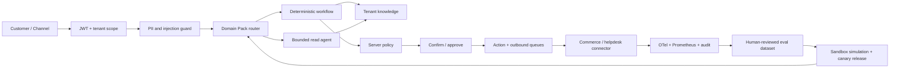

# SupportPilot V4 电商客服平台

SupportPilot V4 是面向真实商家接入的多租户电商客服系统。它用 **LangGraph 工作流 + 受限 Agent** 处理咨询，用版本化 **Domain Pack** 配置行业、品牌、政策、工具和知识，并把线上执行、可观测数据、人工复核、回归评测和灰度发布组成闭环。

> 本地演示无需外部服务：顾客 `demo-001`，订单 `ORD-1001`、`ORD-1002`、`ORD-1003`。生产上线必须配置商家政策、OIDC/JWT、模型和电商平台凭据。

## 核心能力

- **通用到专用**：内置通用、服饰、3C、美妆、食品、家居、跨境七套 Domain Pack；每个租户独立 Draft、模拟、发布和版本回退。
- **混合编排**：订单、售后、知识、多意图和交接走确定性工作流；模糊问题交给最多 N 步、只读工具白名单的 Agent。
- **安全动作**：取消、改址、退换等动作必须经过权限检查、客户确认或人工审批、执行前状态重查、幂等调用和 outbox 审计。
- **真实隔离**：JWT 的 tenant/customer/role claim 驱动查询；conversation、run、feedback、ticket、knowledge、connector、action 和 release 全部按租户过滤。
- **知识治理**：租户知识 Draft/Live、版本、checksum、提示注入扫描、引用、外部知识新鲜度门禁和无依据降级；生产不会加载演示知识。
- **全渠道与人工协同**：签名渠道入口支持外部客户/会话映射和事件幂等；机器人回复、人工回复和动作结果通过持久化外发队列回传；人工接管期间停止自动回复。
- **执行—观测—优化**：OTel span、Prometheus、Grafana、脱敏 AgentRun、租户审计、SLA、知识健康、真实解决率/FCR 和动作成功率；负反馈经人工接受后才进入版本化评测集。
- **发布安全**：隔离 simulation、42 项离线黄金集、V4 集成测试、quality gate、release/canary、人工激活。
- **生产交付**：Alembic、PostgreSQL、Redis 跨进程锁与限流、后台 Worker、Caddy TLS、健康检查、依赖锁、SBOM/安全扫描配置。

## 架构



V4 上线边界见 [V4 Final 交付说明](docs/V4-final.md)，基础设计见 [V3 架构](docs/V3-architecture.md) 和 [威胁模型](docs/threat-model.md)。

## Windows + VS Code 快速开始

要求 Python 3.11+。在 VS Code PowerShell 终端执行：

```powershell
Copy-Item .env.example .env
python -m venv .venv
.\.venv\Scripts\python.exe -m pip install -r requirements-dev.lock
.\.venv\Scripts\python.exe -m pip install -e . --no-deps
.\.venv\Scripts\python.exe -m uvicorn app.main:app --reload
```

打开：

- 客户客服台：<http://127.0.0.1:8000>
- 运营控制台：<http://127.0.0.1:8000/admin>
- OpenAPI：<http://127.0.0.1:8000/docs>
- readiness：<http://127.0.0.1:8000/health/ready>
- Prometheus：<http://127.0.0.1:8000/metrics>

开发模式会创建 SQLite schema 和演示数据。生产模式不会自动建表或写 seed，并会检查 Alembic revision。

## 配置模型

开发默认 `AUTH_MODE=development`，可以直接用演示身份。生产必须使用 `AUTH_MODE=jwt`，token 至少含：

```json
{
  "iss": "https://identity.example.com/",
  "aud": "supportpilot-api",
  "sub": "user-or-service-id",
  "tenant_id": "merchant-id",
  "role": "customer | agent | admin | service",
  "customer_id": "required-for-customer-role",
  "exp": 1789000000
}
```

当前实现原生验证 HS256，也支持通过 HTTPS OIDC JWKS 验证 RS256/ES256；生产优先使用组织身份服务的 JWKS。员工和服务账号还必须存在于租户成员表，JWT 角色与成员角色必须一致。生产环境要求 PostgreSQL、Redis、非通配 CORS，禁用 legacy API key、Mock 连接器和公开 OpenAPI。

## Domain Pack

行业模板位于 `domain_packs/`。控制台可从模板创建数据库 Draft；模板覆盖：

- 品牌 persona、语言和回复规则；
- 意图、路由和多意图上限；
- 退货、取消、改址、折扣与人工审批政策；
- 工具开关、角色和风险等级；
- 知识引用、新鲜度和无依据拒答；
- 外部连接器主机 allowlist、handoff SLA 和质量门禁。

发布流程见 [Domain Pack 指南](docs/domain-pack-guide.md)。系统不会让线上反馈自动修改 Live 配置。

## 连接器与写动作

已实现 `mock`、`generic-rest`、Shopify GraphQL Admin 2026-07 和 Chatwoot 参考适配器。数据库只保存 `env://SECRET_NAME`，真实值由服务端 resolver 读取。

第三方聊天、邮件或社媒渠道可调用签名入口 `POST /api/v1/channels/{connector_id}/messages`。系统用外部顾客 ID 和外部会话 ID 绑定内部租户资源，`X-Event-ID` 重试会返回同一结果。启用 `outbound_chat` 后，回复进入持久化队列，由 Worker 幂等投递并在失败时退避重试或进入死信。

生产接入前先通过 `/api/v1/admin/customer-mappings` 建立平台顾客映射，通过 `/api/v1/admin/members` 配置员工角色。人工工单创建后会话进入 `human` 模式；人员使用 `/tickets/{id}/reply` 回复，通过 `/conversations/{id}/automation` 显式恢复自动模式。

写动作 API：

1. `POST /api/v1/actions` 并提供 `Idempotency-Key`；
2. 服务返回 `confirmation_digest` 和 awaiting 状态；
3. 客户调用 `/actions/{id}/confirm`，或人员调用 `/admin/actions/{id}/approve`；
4. Worker 或受保护的执行接口重新查询订单状态后调用上游；
5. 结果、错误码和 outbox event 持久化。

连接器协议、签名 webhook 和 Shopify 权限见 [连接器指南](docs/connector-guide.md)。

## 执行—观测—优化

客户 UI 不显示内部轨迹。运营面通过 `/admin`、`/api/v1/ops/*`、Prometheus、Grafana 和 OTel 查看：

- error、P50/P95、handoff、containment；
- 客户确认解决率、FCR、reopen；
- action success、connector latency；
- grounded answer、citation；
- handoff SLA、知识新鲜度和租户级变更审计；
- prompt/router/policy/release 版本和节点轨迹。

负反馈或低质量人工复核会生成只含 input hash 和结构化证据的 candidate。管理员接受 candidate 后才能生成新 dataset revision。新 Domain Pack 可通过 `/api/v1/admin/simulations/chat` 在独立数据库回放；simulation 不写线上工单、消息或动作。

## 验证

```powershell
.\.venv\Scripts\ruff.exe format --check app tests scripts
.\.venv\Scripts\ruff.exe check app tests scripts
.\.venv\Scripts\python.exe -m mypy app
.\.venv\Scripts\python.exe -m pytest -q
.\.venv\Scripts\python.exe -m app.evaluation.runner
.\.venv\Scripts\bandit.exe -q -r app
.\.venv\Scripts\python.exe -m pip_audit -r requirements.lock
```

离线门禁包含 42 个中文/英文、政策、隐私、提示注入、多轮、多意图、挫败情绪和欺诈升级场景；V4 集成测试覆盖 JWT 身份、租户成员、资源归属、配置驱动路由、签名渠道幂等、人工接管、外发队列、Domain Pack 发布、知识注入与过期阻断、工单 SLA、动作确认/重查/幂等、沙箱隔离和人工评测集闭环。
CI 同时执行分支覆盖率检查，当前最低门槛为 55%，后续提交不得低于该基线。

## 生产部署

生产 Compose 要求每个镜像都填写不可变 `image@sha256` digest，且没有默认数据库、Redis、JWT 或 Grafana 密码：

```powershell
Copy-Item .env.production.example .env.production
# 填写全部空值、域名、密钥和 image digest

docker compose -f compose.production.yaml up -d
```

部署包含独立 migrate、API、Worker、PostgreSQL、Redis、Caddy、OTel Collector、Tempo、Prometheus、Alertmanager 和 Grafana。启动前需创建 `ALERT_WEBHOOK_URL_FILE` 指向的单行 secret 文件。Python 运行、迁移 smoke、单元/集成测试和离线评测可在 Windows 本机完成。

完整步骤、SLO、告警、备份、恢复和故障处置见 [生产运行手册](docs/production-runbook.md)。

## 项目结构

```text
app/
├── actions/       # 确认、审批、重查、幂等与 outbox
├── agent/         # LangGraph workflow + bounded agent
├── api/           # 客户、控制面、运营和 webhook API
├── channels/      # 持久化外发投递与重试
├── connectors/    # Mock / Generic REST / Shopify / Chatwoot
├── core/          # 配置、JWT、Redis coordination、telemetry
├── db/            # 多租户模型、仓储和 seed
├── domain/        # Domain Pack、路由、政策和 guardrail
├── evaluation/    # 离线门禁与隔离 simulation
├── ops/           # 质量聚合
├── optimization/  # 证据化优化建议
├── static/        # 客户台与独立运营控制台
└── worker.py      # 可恢复动作与外发 Worker
domain_packs/      # 七套领域模板
migrations/        # Alembic 前向迁移
ops/               # TLS、OTel、Prometheus、Grafana
```

## 对标与开源说明

本项目代码为独立实现，没有复制参考仓库。V4 对照 Intercom、Gorgias、Salesforce Agentforce、Decagon、Sierra，以及 XianyuAutoAgent、ChatGPT-On-CS、Chatwoot、Langfuse、Agent Health 等公开资料。参考项目采用 GPL/AGPL，本项目只吸收会话上下文、人工接管和渠道适配等设计思路。逐项映射见 [V4 Final 交付说明](docs/V4-final.md)。

## License

[MIT](LICENSE)
