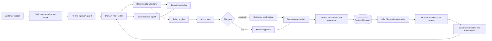

# SupportPilot V3 架构

## 目标

SupportPilot V3 是一个通用、多租户的电商客服平台。每个商家通过版本化 Domain Pack 把通用能力收敛成自己的品牌、政策、工具和知识范围。运行时将确定性工作流和受限 Agent 放在同一状态图中；所有写操作都离开模型上下文，进入确认、审批、幂等和审计状态机。

## 信任边界

- JWT 中的 `tenant_id`、`role` 和 `customer_id` 是服务端身份来源。请求体中的 `customer_id` 只为本地兼容保留；JWT 模式下不允许覆盖。生产员工和服务身份还要通过 `TenantMember` 状态与角色校验。
- `ConversationScope`、`AgentRunScope`、tenant customer mapping 和所有 V3 资源在仓储查询中强制带 tenant 条件。
- Agent 只有已发布 Domain Pack 允许的只读上下文。写动作必须经过 `ActionService`。
- 连接器密钥只保存 `env://NAME` 引用。浏览器、Domain Pack、日志和数据库配置中不保存密钥值。
- 生产环境启动会拒绝 SQLite、开发认证、弱 JWT Secret、未启用租户成员校验、公开 API 文档、缺少 Redis、通配 CORS 或未迁移数据库。

## 工作流与 Agent 分工

确定性工作流处理订单归属、物流、退换政策、知识检索、多意图拆分和人工交接。Agent 处理无法枚举的表达，只能调用绑定当前客户的查询工具。步数由 Domain Pack 限制，模型异常或达到上限后创建人工工单。

## 数据与恢复

PostgreSQL 是业务事实与审计来源。Redis 只用于跨进程限流和幂等锁，不保存唯一业务事实。`WorkflowCheckpoint` 保存每轮最小状态投影，`ActionExecution` 和 `OutboxEvent` 使写动作可恢复；`WebhookEvent` 与 `ChannelConversation` 保证渠道事件和会话映射可重试；`AuditEvent` 不保存请求正文或秘密。生产变更只能通过 Alembic 前向迁移。

## 控制面

`/admin` 与客户界面分离。控制面可以查看质量、工单、连接器和 Domain Pack，从行业模板创建 Draft，并在人工审核后发布。模拟使用独立内存数据库，不会创建线上工单或动作。
