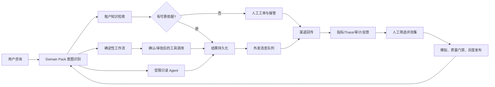

# SupportPilot V4 Final 交付说明

## 完整业务循环

循环中的每一步都有可验证状态：意图和 route 写入 trace；检索结果携带 source/revision；写动作进入确认状态机；结果先落库再投递；人工工单将会话设为 `human`；指标和反馈形成候选数据，只有人工接受后才进入下一版评测集。

## V4 关键修正

- Domain Pack 的 `route`、`confidence_threshold` 和 `workflow_order` 直接决定运行路径。
- 无可靠知识、订单安全核验、策略拒绝和 Agent 故障都会真实创建工单，不再只返回“可以转人工”的文本。
- 人工接管后，渠道消息只持久化给工作人员，不调用模型。恢复自动回复需要员工显式操作。
- `OutboundMessage` 保存机器人回复、人工回复和动作结果；Worker 使用幂等键、指数退避、最大尝试次数和死信状态。
- 连接器启用时校验声明能力，避免 Domain Pack、连接器配置和实际适配器实现漂移；外部顾客身份按租户与连接器隔离。
- 知识按固定上限和重叠窗口切块，可用 `locales`、`external_product_ids` 元数据限制领域范围；陈旧外部知识不参与回答。
- PostgreSQL、Redis、JWT/JWKS、租户成员二次授权、TLS、Tempo、Prometheus、Alertmanager、Grafana 和审计组成生产运行基线。

## 上线顺序

1. 复制 `.env.production.example`，填写密码、OIDC/JWKS、模型密钥、镜像 digest、域名和 Alertmanager webhook secret 文件。
2. 为商家创建并发布 Domain Pack，导入并发布知识源；知识 metadata 可包含 `title`、`locales` 和 `external_product_ids`。
3. 创建连接器；只声明适配器真正实现的 capability。聊天回传需要 `send_message` 和 `outbound_chat`。
4. 创建外部顾客映射与租户成员。生产环境会同时验证 JWT claim 和成员表。
5. 执行 `alembic upgrade head`，确认 `/health/ready` 返回 HTTP 200；degraded 状态会返回 HTTP 503。
6. 执行质量门禁，通过后建立 release，先 canary，再由管理员提升为 active。
7. 验证一条真实渠道消息、一次人工接管和恢复、一次需要确认的写动作、一次告警通知与一次备份恢复演练。

## 外部边界

XianyuAutoAgent 和 ChatGPT-On-CS 展示了商品上下文、渠道接入、快捷回复和人工接管等实用模式。它们分别使用 GPL/AGPL 授权，并包含浏览器或平台会话自动化方案。SupportPilot 未复制其代码，也不依赖逆向协议；生产接入通过官方 API、签名 webhook 或商家自有 Generic REST 适配器完成。

不同平台的字段、权限和消息格式仍需商家按官方 API 填写 connector 配置。模型密钥、平台令牌、OIDC 配置、镜像 digest、域名和告警目的地属于部署环境秘密，仓库不会提供通用默认值。
